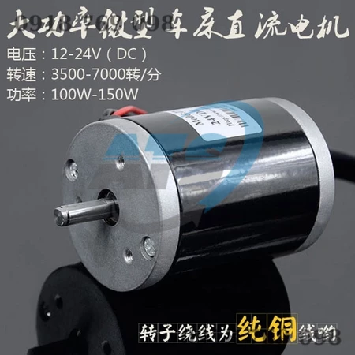
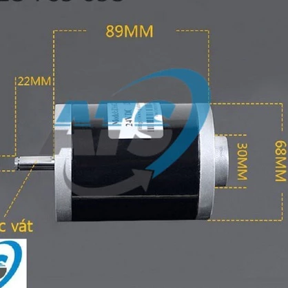
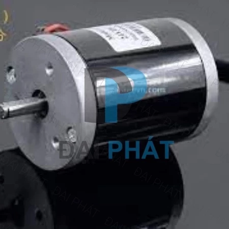

# Thông Số Kỹ Thuật & Kích Thước Lỗ Ốc Động Cơ ATS Motor (ZY6812 / MY6812) 12-24V 150W 7000RPM

---

## 1. Hình Ảnh Thực Tế & Bản Vẽ Kích Thước

| Ảnh 1: Thông số & Mặt trước Motor | Ảnh 2: Kích thước thân & Trục | Ảnh 3: Mặt trước 3 lỗ bắt ốc tam giác |
| :---: | :---: | :---: |
|  |  |  |

---

## 2. Bảng Thông Số Điện - Cơ Học (Electrical & Mechanical Specs)

* **Tên thương mại:** Động cơ ATS Motor / Động cơ máy tiện mini DC / Động cơ ZY6812 (MY6812 / 68ZYT)
* **Loại động cơ:** Động cơ điện một chiều chổi than (Brushed DC Motor), nam châm vĩnh cửu
* **Rotor:** Cuộn dây đồng 100% (Pure copper winding)
* **Điện áp hoạt động:** DC $12\text{V} - 24\text{V}$
* **Công suất định mức:** $100\text{W} - 150\text{W}$ (Đạt cực đại $150\text{W}$ tại $24\text{V}$)
* **Tốc độ vòng tua (Speed):**
  * Tại $12\text{V}$: $\approx 3.500\text{ RPM}$
  * Tại $24\text{V}$: $\approx 7.000\text{ RPM}$ (Không tải có thể đạt $7.000 - 7.500\text{ RPM}$)
* **Dòng không tải (No-load Current):** $\approx 0.8\text{A} - 1.2\text{A}$
* **Dòng định mức (Rated Current):** $\approx 4.0\text{A} - 8.0\text{A}$
* **Dòng khởi động / Khóa trục (Stall Current):** $\approx 10\text{A} - 15\text{A}$ (Khuyến nghị dùng nguồn $24\text{V} \ge 10\text{A}$ hoặc ắc quy)
* **Hướng quay:** 2 chiều (Đảo chiều bằng cách đổi cực cấp nguồn $+/-$)
* **Trọng lượng:** $\approx 1.05\text{ kg} - 1.15\text{ kg}$

---

## 3. Kích Thước Hình Học Tổng Thể (Overall Dimensions)

| Bộ phận | Kích thước thực tế | Ghi chú |
| :--- | :---: | :--- |
| **Đường kính thân motor ($\varnothing D$)** | **$68\text{ mm}$** | Thân trụ tròn kim loại sơn đen bóng |
| **Chiều dài thân kim loại ($L_{body}$)** | **$89\text{ mm}$** | Phần thân chính giữa 2 nắp nhôm trước/sau |
| **Chiều dài tổng thể ($L_{total}$)** | **$\approx 115 - 120\text{ mm}$** | Bao gồm trục nhô phía trước và gờ đuôi sau |
| **Đường kính trục ($\varnothing d_{shaft}$)** | **$\varnothing 8\text{ mm}$** | Trục thép chuẩn $\varnothing 8\text{ mm}$ |
| **Chiều dài trục nhô ra ($L_{shaft}$)** | **$22\text{ mm}$** | Đo từ mặt bích nhôm trước ra đầu trục |
| **Kiểu trục (Shaft Type)** | **Trục vát phẳng D (D-Cut Shaft)** | Chiều dày sau vát $\approx 7.2 - 7.5\text{ mm}$, tiện lắp ốc chí puly/khớp nối |
| **Gờ định vị đuôi sau (Rear Boss)** | **$\varnothing 30\text{ mm}$**, nhô **$4 - 6\text{ mm}$** | Nắp ổ đỡ bạc đạn sau |
| **Gờ định vị mặt trước (Front Boss)** | **$\varnothing 28 - 30\text{ mm}$**, nhô **$\approx 3 - 4\text{ mm}$** | Gờ định vị tâm ổ bi trước |

---

## 4. CHI TIẾT KÍCH THƯỚC 3 LỖ VẶN VÍT MẶT BÍCH (3-Hole Triangle Mounting Pattern)

Theo bản vẽ kỹ thuật chuẩn quốc tế của dòng motor 6812 (MY6812/ZY6812) và hình ảnh thực tế từ xưởng Đại Phát / ATS:

```
                            [ Lỗ Ren 1 (90° - Đỉnh trên) ]
                                         ●
                                       /   \
                                      /  ○  \   (Trục Ø8mm + Gờ Ø29.5mm)
           Khoảng cách cạnh: 35.6mm  /   |   \  Khoảng cách cạnh: 35.6mm
                                    /    R    \
                                   /     |     \
                                  ● ----------- ●
             [ Lỗ Ren 2 (210° - Dưới trái) ]    [ Lỗ Ren 3 (330° - Dưới phải) ]
                                   Khoảng cách đáy: 35.6mm
```

### 4.1. Thông số hình học 3 lỗ bắt ốc:
1. **Số lượng lỗ bắt vít:** **3 lỗ ren M5** bố trí dạng **tam giác đều cách nhau $120^\circ$**.
2. **Kích thước ren (Thread Size):** **Ren M5** (bước ren tiêu chuẩn $M5 \times 0.8\text{ mm}$).
   * Độ sâu ren: $\approx 6\text{ mm} - 8\text{ mm}$.
3. **Khoảng cách giữa các lỗ (Center-to-Center Pitch):**
   * **Khoảng cách thẳng giữa 2 lỗ cạnh nhau (cạnh tam giác $a$):** **$35.6\text{ mm}$** (tương đương $1.4\text{ inch}$).
   * **Đường kính vòng chia tâm lỗ (Pitch Circle Diameter - PCD):**
     $$\text{PCD} = \frac{2a}{\sqrt{3}} = \frac{2 \times 35.6}{1.732} \approx \mathbf{41.1\text{ mm}} \quad (\text{Bán kính từ tâm trục } R \approx \mathbf{20.5\text{ mm}})$$
4. **Tọa độ tâm 3 lỗ ốc (Gốc $(0,0)$ tại tâm trục động cơ):**
   * **Lỗ 1 (Đỉnh trên $90^\circ$):** $(X = 0,\ Y = +20.5\text{ mm})$
   * **Lỗ 2 (Dưới - Trái $210^\circ$):** $(X = -17.8\text{ mm},\ Y = -10.25\text{ mm})$
   * **Lỗ 3 (Dưới - Phải $330^\circ$):** $(X = +17.8\text{ mm},\ Y = -10.25\text{ mm})$

---

## 5. Khuyến Nghị Khi Thiết Kế Gá Đỡ / Pat Bắt Động Cơ 3 Lỗ (Bracket Design Tips)

1. **Làm 3 rãnh hạt đậu (Slotted Holes):**
   * Bố trí 3 rãnh ở 3 góc $90^\circ, 210^\circ, 330^\circ$.
   * Chiều rộng rãnh: $\varnothing 5.5\text{ mm}$ (dễ dàng xỏ ốc M5).
   * Bán kính rãnh: Kéo dài từ $R = 18.0\text{ mm} \rightarrow R = 22.0\text{ mm}$ (PCD từ $36\text{ mm} \rightarrow 44\text{ mm}$) để triệt tiêu mọi sai số gia công giữa các xưởng OEM.
2. **Lỗ thoát gờ tâm (Center Pilot Hole):** Khoét lỗ tròn đường kính **$\varnothing 31\text{ mm}$** để lọt hoàn toàn gờ bạc đạn mặt trước ($\varnothing 29.5\text{ mm}$).
3. **Chiều dài bu-lông M5:** Dùng bu-lông M5 dài $10 - 12\text{ mm}$ (kèm long đen vênh chống trôi ốc do rung động động cơ).
